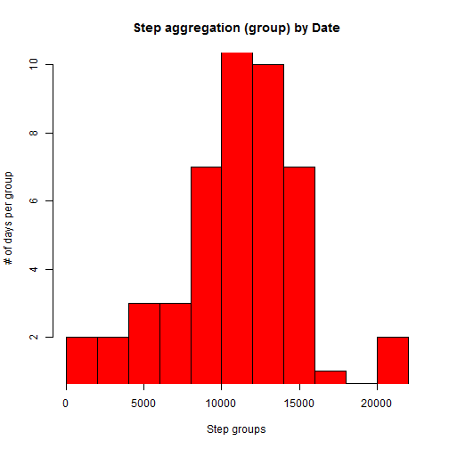
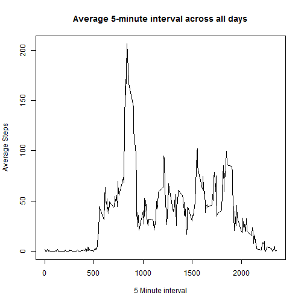
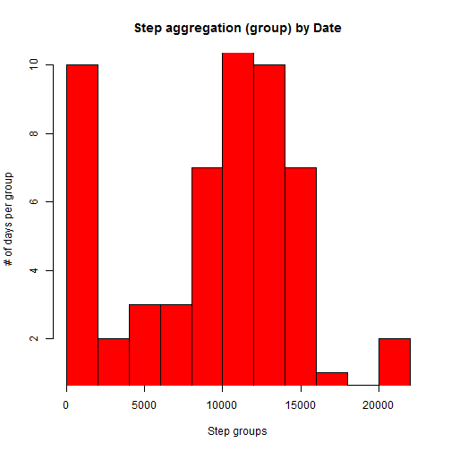
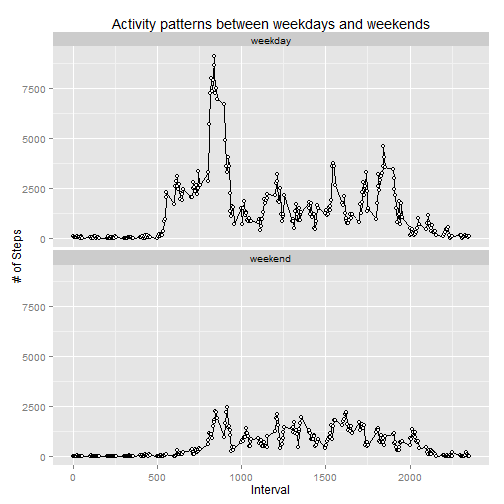

Introduction
============

It is now possible to collect a large amount of data about personal movement using activity monitoring devices such as a Fitbit, Nike Fuelband, or Jawbone Up. These type of devices are part of the "quantified self" movement - a group of enthusiasts who take measurements about themselves regularly to improve their health, to find patterns in their behavior, or because they are tech geeks. But these data remain under-utilized both because the raw data are hard to obtain and there is a lack of statistical methods and software for processing and interpreting the data.

This assignment makes use of data from a personal activity monitoring device. This device collects data at 5 minute intervals through out the day. The data consists of two months of data from an anonymous individual collected during the months of October and November, 2012 and include the number of steps taken in 5 minute intervals each day.

Data
====

The dataset can be found in the following: [Activity monitoring data](https://d396qusza40orc.cloudfront.net/repdata%2Fdata%2Factivity.zip)

The variables included in this dataset are:

1. **steps**: Number of steps taking in a 5-minute interval (missing values 
              are coded as NA)

2. **date**:  The date on which the measurement was taken in YYYY-MM-DD format

3. **interval**: 
              Identifier for the 5-minute interval in which measurement was 
              taken

The dataset is stored in a comma-separated-value (CSV) file and there are a total of 17,568 observations in this dataset.

###Define the questions

1. What is mean total number of steps taken per day?
2. What is the average daily activity pattern?
3. What is the impact of imputing missing values on the first question?
4. Are there differences in activity patterns between weekdays and weekends?

###Obtain the data

```r
ActData <- read.csv("activity.csv", header = TRUE, sep = ",")
require(ggplot2)
require(knitr)
require(markdown)
require(sqldf)
```

```
## Loading required package: sqldf
```

```
## Warning: package 'sqldf' was built under R version 3.0.3
```

```
## Loading required package: gsubfn
```

```
## Warning: package 'gsubfn' was built under R version 3.0.3
```

```
## Loading required package: proto
## Loading required namespace: tcltk
## Loading required package: RSQLite
## Loading required package: DBI
## Loading required package: RSQLite.extfuns
```

###Clean and Explore the data
No special cleaning will be done at this point. Further cleaning and data manipulation will be performed later in the process.


```r
str(ActData)
```

```
## 'data.frame':	17568 obs. of  3 variables:
##  $ steps   : int  NA NA NA NA NA NA NA NA NA NA ...
##  $ date    : Factor w/ 61 levels "2012-10-01","2012-10-02",..: 1 1 1 1 1 1 1 1 1 1 ...
##  $ interval: int  0 5 10 15 20 25 30 35 40 45 ...
```

```r
summary(ActData)
```

```
##      steps               date          interval   
##  Min.   :  0.0   2012-10-01:  288   Min.   :   0  
##  1st Qu.:  0.0   2012-10-02:  288   1st Qu.: 589  
##  Median :  0.0   2012-10-03:  288   Median :1178  
##  Mean   : 37.4   2012-10-04:  288   Mean   :1178  
##  3rd Qu.: 12.0   2012-10-05:  288   3rd Qu.:1766  
##  Max.   :806.0   2012-10-06:  288   Max.   :2355  
##  NA's   :2304    (Other)   :15840
```
###Exploratory data analysis and interpret results
**Question #1: What is mean total number of steps taken per day?**


```r
aggdata <-aggregate(ActData$steps, by= list(ActData$date), 
                    FUN=sum, na.rm=FALSE)
names(aggdata) <- c("date", "sum_steps")
hist(as.numeric(aggdata$sum_steps) ,col = "Red", 
     main = "Step aggregation (group) by Date", 
     xlab = "Step groups", ylab = "# of days per group", breaks = 10, 
     ylim = range(1:10))
```

 

```r
aggdata_sum <- aggregate(steps ~ date, data = ActData, sum)
aggdata_mean <- mean(aggdata_sum$steps, na.rm = FALSE)
aggdata_median <- median(aggdata_sum$steps, na.rm = FALSE)
```

**The report mean is 1.0766 &times; 10<sup>4</sup> and 
the report median is 10765**

**Question #2: What is the average daily activity pattern?**


```r
aggdata_interval <- aggregate(steps ~ interval, data = ActData, mean)
with(aggdata_interval,plot(interval,steps,
                     main = "Average 5-minute interval across all days",       
                     xlab = "5 Minute interval",ylab = "Average Steps", 
                     type = "l"))
```

 

```r
max_interval <- max(aggdata_interval$steps, na.rm = FALSE)
aggdata_interval[aggdata_interval$steps == max_interval,]
```

```
##     interval steps
## 104      835 206.2
```

**Interval 835 with 206.1698 is the most active interval**

**Question #3: What is the impact of imputing missing values on the first question?**


```r
missing_values <- sum(is.na(ActData$steps))
```
**The total number of missing values (steps) is 2304**

The **strategy for filling in all the missing values** was to replace them with teh value 0.0001 to minimize the impact on the analysis. Teh strategy was implemented using the following code:


```r
ActData_nona <- ActData
index <- is.na(ActData$steps)
ActData_nona$steps <- replace(ActData$steps, index == TRUE, 0.001)
```

Below is the Histogram after filling in the missing values. The impact is that the first bar / group have bigger numbers.


```r
aggdata_nona <-aggregate(ActData_nona$steps, by= list(ActData_nona$date), 
                    FUN=sum, na.rm=FALSE)
names(aggdata_nona) <- c("date", "sum_steps")
hist(as.numeric(aggdata_nona$sum_steps) ,col = "Red", 
     main = "Step aggregation (group) by Date", 
     xlab = "Step groups", ylab = "# of days per group", breaks = 10, 
     ylim = range(1:10))
```

 

```r
aggdata_sum_nona <- aggregate(steps ~ date, data = ActData_nona, sum)
aggdata_mean_nona <- mean(aggdata_sum_nona$steps, na.rm = FALSE)
aggdata_median_nona <- median(aggdata_sum_nona$steps, na.rm = FALSE)
```
**The report mean is 9354.2673 and 
the report median is 1.0395 &times; 10<sup>4</sup>**

**Question #4: Are there differences in activity patterns between weekdays and weekends?**

The below code was used to create a categorical variable to distinguish between weekend and weekday activities.


```r
ActData_nona$day <- weekdays(as.Date(ActData_nona$date, "%Y-%m-%d"), 
                                     abbreviate = FALSE)
ActData_nona$weekendInd <- (ActData_nona$day %in% c('Saturday','Sunday'))
ActData_nona$weekendInd <- replace(ActData_nona$weekendInd, 
                                   ActData_nona$weekendInd == TRUE, 
                                   "weekend")
ActData_nona$weekendInd <- replace(ActData_nona$weekendInd, 
                                   ActData_nona$weekendInd == FALSE, 
                                   "weekday")
```

The below R code produced the panel plot which clearly shows that weekday days are more active.


```r
ActData_interval_weekend <- aggregate(steps ~ interval + weekendInd,
                                      data = ActData_nona, sum)

g <- ggplot(ActData_interval_weekend, 
            aes(ActData_interval_weekend$interval, 
                ActData_interval_weekend$steps))
g + geom_point() + 
  facet_wrap(~ weekendInd, nrow = 2, ncol = 1) + 
  geom_line() +
  geom_point( size=2, shape=21, fill="white") +
  ggtitle("Activity patterns between weekdays and weekends") +
  xlab("Interval") +
  ylab("# of Steps")
```

 

Note that the `echo = FALSE` parameter was added to the code chunk to prevent printing of the R code that generated the plot.
